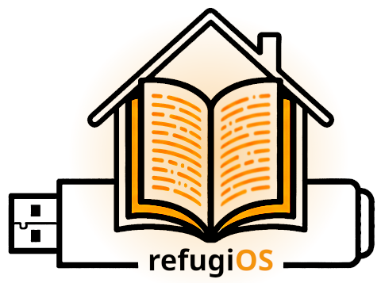

# refugiOS - Your Digital Refuge and Survival Library

<p align="center">
  <br />
  
  
  
  
  
</p>

> [!WARNING]
> **Project Status:** refugiOS is currently in its **first Alpha version**. It is an actively developing project and there is still a long way to go: internationalization of the documentation, migration to wiki format, and polishing of certain features.

---

## 📖 What is refugiOS?

**refugiOS** is a portable operating system designed for emergency situations, lack of Internet connectivity, or extreme privacy needs.

Unlike other complex solutions, **refugiOS turns any ordinary computer (even an old one) into a complete information station** that boots directly from a USB drive.

It also works on **Raspberry Pi**, turning it into a compact, silent, and low-power information station.

It is a tool designed to have all vital knowledge, maps, and documents at hand in a safe, private, and fully functional way without depending on the cloud.

## ✨ Main Features

*   **⚡ Boots on any PC (Plug-and-play):** You don't need to install anything on the computer you find. You connect the USB, turn on the machine, and your digital refuge is already running at full capacity.
*   **🍓 Native Raspberry Pi Support:** Certified installation on Raspberry Pi 3B+. The installer automatically detects the ARM architecture and adapts all decisions (APT packages, renderers, bootloaders).
*   **📚 Universal Offline Knowledge:** Includes complete copies of Wikipedia, WikiMed (medicine), survival encyclopedias, and trade guides thanks to *Kiwix* technology.
*   **🤖 Private Artificial Intelligence:** Incorporates an assistant that works 100% locally, without Internet. It can help you solve technical, medical, or translation problems using only local models running at CPU speed.
*   **🗺️ Maps and GPS Navigation:** Detailed maps of the entire world via *Organic Maps*. You can search for routes and points of interest (fountains, hospitals, shelters) without emitting any signal or leaving a trace.
*   **🔒 Secure File Vault:** Professional encryption system to store your most important documents (passports, titles, photos) protected by a master password.
*   **🌐 Adapted to Your Language:** The system automatically configures in your language (Spanish, English, French, etc.), downloading only the dictionaries and help files you need.
*   You can see in the [Applications and Software](doc/modulos_de_software.md) section the current status of the project, with the modules that are already implemented and those that will be added in the future.

## 📸 Screenshots

| Element | Screenshot |
| :--- | :--- |
| **Main Interface** | <br>*Main menu with a vault open* |
| **Knowledge** | <br>*Medical encyclopedia (WikiMed)* |
| **Navigation** | <br>*Cartography and offline navigation* |
| **Assistant** | <br>*Local Artificial Intelligence* |

### 📺 Demo Video

<p align="center">
  <a href="https://www.youtube.com/watch?v=VrP8VIxQZGg">
    
  </a>
  <br>
  <em>refugiOS running on a 2018 Microsoft Surface, booted from a 16GB USB drive and completely offline</em>
</p>

## 🚀 Quick Installation

### 💻 On Xubuntu (PC / Laptop)

If you already have a USB with Xubuntu freshly installed, you just need to connect the computer to the Internet once and run this command in the terminal:

```bash
sudo apt install curl -y
curl -fsSL https://raw.githubusercontent.com/Ganso/refugiOS/main/install.sh | bash
