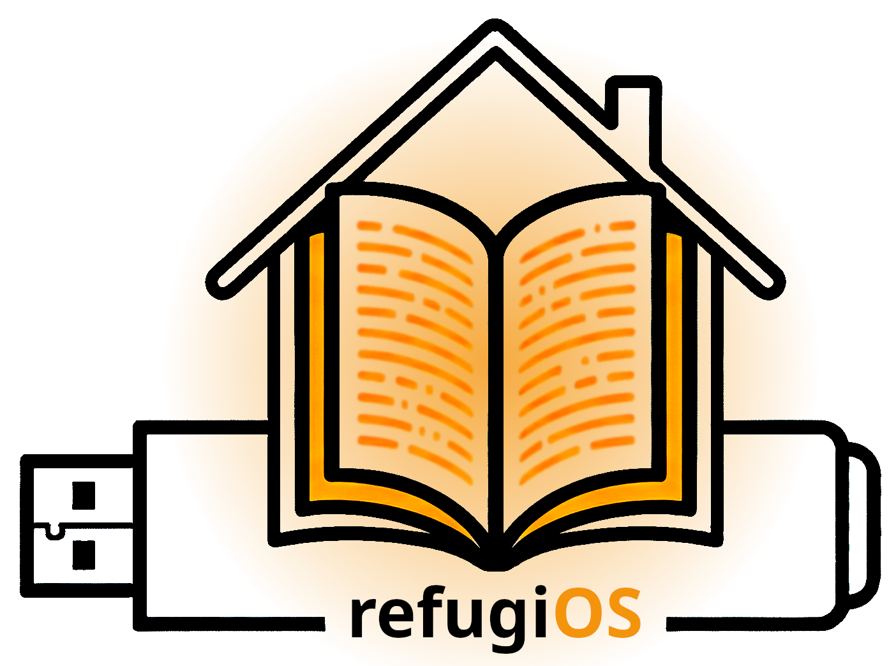

<h1 align="center">
  refugiOS - Your Digital Refuge and Survival Library
</h1>

<p align="center">
  <a href="README.md"><strong>🇪🇸 Leer en Español</strong></a>
</p>

<p align="center">
  <br />
  
  
  
  
  
</p>

> [!WARNING]
> **Project Status:** refugiOS is currently in its **first Beta version**. It is an actively developing project and there is still work to do: bug fixing and implementing the features detailed in the roadmap.

> [!IMPORTANT]
> **refugiOS is not a typical Linux distribution.** It does not install on your hard drive or replace your operating system. It is a portable system that boots from a USB drive and works completely autonomously, without installing anything on the host computer. You only need a 16 GB or larger USB drive.

## What is refugiOS?

**refugiOS** is a portable operating system designed to work without an Internet connection in emergency situations or for personal resilience. It lives on a USB drive and boots on any PC or Raspberry Pi, carrying with it a full copy of Wikipedia, offline maps of the entire world, a private local AI, encrypted personal file storage, and survival guides — all running without depending on any server or cloud service.

The idea is simple: **prepare it today at home, use it when there's no Internet.**

→ See the [Vision and User Experience](doc/Vision-and-User-Experience-EN.md) for a full description of the project and what to expect when using it.

---

## Quick Start: Download the Pre-built Image

The easiest way to get refugiOS is to download the ready-made image, flash it to a USB drive, and boot:

### 1. Download the image

| Language | Link | Approx. Size |
| :--- | :--- | :--- |
| 🇬🇧🇺🇸 **English** | [refugios-base-16G-en.img](https://refugios.ganso.org/refugios-base-16G-en.img) | ~16 GB |
| 🇪🇸 **Spanish** | [refugios-base-16G-es.img](https://refugios.ganso.org/refugios-base-16G-es.img) | ~16 GB |

You need a USB drive of **at least 16 GB**. The system partition will automatically expand to the full size of the USB drive on first boot.

> [!NOTE]
> **Why isn't a fully pre-configured image offered?**
> Offering a ready-to-use image with all possible contents (full Wikipedia with images, multiple local AI models, world maps, etc.) would require a massive download file of over 150 GB. That is why a **lightweight base image** is distributed instead. It must be configured in a controlled, non-emergency environment with a good internet connection. This ensures that when a real emergency strikes, your device will contain exactly the specific information and resources you need.

### 2. Flash the image to your USB

**From Windows** — Use [Rufus](https://rufus.ie/) or [balenaEtcher](https://etcher.balena.io/):
1. Open Rufus, select your USB drive and the downloaded `.img` file.
2. Make sure the partition scheme is **GPT** and the target system is **UEFI**.
3. Click **Start** and wait.

**From Linux** — With the `dd` command:
```bash
# Verify with lsblk that /dev/sdX is your USB drive!
sudo dd if=refugios-base-16G-en.img of=/dev/sdX bs=4M status=progress conv=fsync
```

**From macOS** — Use [balenaEtcher](https://etcher.balena.io/) or the `dd` command:
```bash
sudo dd if=refugios-base-16G-en.img of=/dev/diskN bs=4M
```

### 3. Boot from the USB

1. Connect the USB to any PC and turn it on.
2. Press **F12**, **F8**, or **Esc** during boot to select the USB as the boot device.
3. The system will boot directly to the XFCE desktop with the user `refugios` (no password).

### 4. Complete the installation

> [!IMPORTANT]
> **The entire initial setup (including running this wizard) must be done in a controlled environment with an Internet connection BEFORE an emergency occurs.** Once all steps are completed and you have verified the system works correctly, your device will be ready to operate 100% offline.

On the desktop you will find the **"Complete refugiOS installation"** icon. Double-click it, connect to the Internet when prompted, and the wizard will download and install all content according to your USB drive's capacity.

You can also run it from the terminal:
```bash
curl -fsSL https://raw.githubusercontent.com/Ganso/refugiOS/main/install.sh | bash
```

> [!TIP]
> The choice of physical device (pendrive, SSD, adapter) affects the performance and durability of your refugiOS. Check the **[Choosing Installation Media Guide](doc/Choosing-Installation-Media-EN.md)** before purchasing.

---

## Alternative Methods

The pre-built image is the fastest and easiest way, but if you need it, you can also set up refugiOS in other ways:

<details>
<summary><strong>💻 Mount refugiOS on a Xubuntu Live USB</strong></summary>

If you prefer to use a Xubuntu ISO as a base, you can create a live USB with persistence and then install refugiOS on top. This method offers compatibility with older hardware (BIOS/MBR) and a dual scheme (immutable system + persistence layer).

1. Download [Xubuntu Minimal](https://xubuntu.org/) and create a persistent USB with [Rufus](https://rufus.ie/) or [mkusb](https://help.ubuntu.com/community/mkusb).
2. Boot from the USB and run the installer:
   ```bash
   sudo apt install curl -y
   curl -fsSL https://raw.githubusercontent.com/Ganso/refugiOS/main/install.sh | bash
   ```

See the **[Xubuntu Installation Guide](doc/Xubuntu-Installation-EN.md)** for complete steps.

</details>

<details>
<summary><strong>🍓 Mount refugiOS on Raspberry Pi</strong></summary>

refugiOS works on Raspberry Pi 3B+ and above with Raspberry Pi OS:

1. Install [Raspberry Pi OS (64-bit)](https://www.raspberrypi.com/documentation/computers/getting-started.html#raspberry-pi-imager) with Raspberry Pi Imager.
2. Boot and run:
   ```bash
   sudo apt install curl -y
   curl -fsSL https://raw.githubusercontent.com/Ganso/refugiOS/main/install.sh | bash
   ```

The installer detects the ARM architecture and adapts everything automatically. See the **[Raspberry Pi Installation Guide](doc/Raspberry-Pi-Installation-EN.md)**.

</details>

<details>
<summary><strong>🛠️ Build your own system image</strong></summary>

If you need full control over the base image or want to prepare multiple identical units, you can generate an image from scratch with Debian Trixie + XFCE:

```bash
sudo bash scripts/build_refugios.sh 16G
```

See the **[System Image Build Guide](doc/System-Image-Build-EN.md)** for full details.

</details>

---

## Try in a Virtual Machine

If you want to try refugiOS before flashing it to a USB, you can boot any of the images (pre-built or self-built) in a virtual machine with QEMU or VirtualBox. This works for x86 (PC and Xubuntu); Raspberry Pi requires real hardware.

```bash
# With QEMU and KVM acceleration (Linux)
sudo qemu-system-x86_64 -enable-kvm -m 4G \
  -bios /usr/share/ovmf/OVMF.fd \
  -drive file=refugios-base-16G-en.img,format=raw
```

See the **[Virtualization Guide](doc/Virtualization-Guide-EN.md)** for complete instructions with QEMU, VirtualBox, and methods to test Xubuntu images.

---

## Main Features

*   **⚡ Boots on any PC:** Plug in the USB, turn it on, and your digital refuge works. Nothing is installed on the host computer.
*   **🍓 Native Raspberry Pi Support:** Certified installation on Raspberry Pi 3B+.
*   **📚 Universal Offline Knowledge:** Complete copies of Wikipedia, WikiMed, survival encyclopedias, and trade guides.
*   **🤖 Private AI:** An assistant that works 100% locally, without Internet.
*   **🗺️ Maps and GPS Navigation:** Offline maps of the entire world with Organic Maps.
*   **🔒 Secure File Vault:** Professional LUKS encryption to protect sensitive documents.
*   **🌐 Adapted to Your Language:** The system automatically configures in English or Spanish.

See the **[Modules and Roadmap](doc/Modules-and-Roadmap-EN.md)** for the current project status.

### Demo Video

<p align="center">
  <a href="https://www.youtube.com/watch?v=ZsVwWdWbtng">
    
  </a>
  <br>
  <em>refugiOS running on a Ryzen 5500, booting from a consumer 3.2 USB flash drive</em>
</p>

---

## Detailed Documentation

### Fundamentals
*   **[Vision and User Experience](doc/Vision-and-User-Experience-EN.md):** What refugiOS is and what to expect.
*   **[Comparison of Solutions](doc/Comparison-of-Solutions-EN.md):** Why refugiOS is different from other alternatives.
*   **[System Architecture](doc/System-Architecture-EN.md):** Technical details about the Linux base and its performance.

### Installation and Configuration
*   **[Choosing Installation Media](doc/Choosing-Installation-Media-EN.md):** Which USB or SSD to buy based on your budget.
*   **[Virtualization Guide](doc/Virtualization-Guide-EN.md):** How to test refugiOS in a virtual machine (QEMU, VirtualBox).
*   **[Xubuntu Installation](doc/Xubuntu-Installation-EN.md):** Alternative method on a Xubuntu Live USB.
*   **[Raspberry Pi Installation](doc/Raspberry-Pi-Installation-EN.md):** Specific guide for Raspberry Pi.
*   **[System Image Build](doc/System-Image-Build-EN.md):** How to generate your own image from scratch.
*   **[Compatibility Table](doc/Compatibility-EN.md):** Certified distributions and hardware.

### Usage and Maintenance
*   **[Security Vaults](doc/Security-Vaults-EN.md):** How personal file encryption works.
*   **[Unit Cloning](doc/Cloning-Units-EN.md):** How to make exact copies of your USB.
*   **[Modules and Roadmap](doc/Modules-and-Roadmap-EN.md):** Available and planned modules.

---

## Acknowledgements and Sources

Special thanks to [Felipe Monge "PlayOnRetro"](https://x.com/PlayOnRetro) for the logo design.

refugiOS is possible thanks to the incredible work of open source projects like:
*   [Debian](https://www.debian.org/) and [Xubuntu](https://xubuntu.org/) for the operating system base.
*   [Raspberry Pi Foundation](https://www.raspberrypi.com/) for the hardware and ARM software ecosystem.
*   [Kiwix](https://www.kiwix.org/) and the [Wikimedia Foundation](https://wikimediafoundation.org/) for offline access to universal knowledge.
*   [Mozilla Ocho](https://github.com/Mozilla-Ocho/llamafile) for the Llamafile inference engine.
*   [HuggingFace](https://huggingface.co/) and [unsloth](https://huggingface.co/unsloth) for the optimized AI model quantizations.
*   **Qwen3** (Alibaba-Qwen: 0.6B, 8B, 14B) and **Gemma-4** (Google: E4B, 26B-A4B) language models.
*   [Organic Maps](https://organicmaps.app/) and [OpenStreetMap](https://www.openstreetmap.org/) contributors for offline mapping.
*   [Aria2](https://aria2.github.io/) for high-efficiency downloads.
*   [Flatpak](https://flatpak.org/) and [Flathub](https://flathub.org/) for modern application distribution.
*   [Cryptsetup / LUKS](https://gitlab.com/cryptsetup/cryptsetup) for personal data security and encryption.

---
*(refugiOS is an open source initiative for digital resilience. Currently in Beta phase, we are looking for collaborators to internationalize the documentation and polish the user experience according to our [Roadmap](doc/Modules-and-Roadmap-EN.md)).*