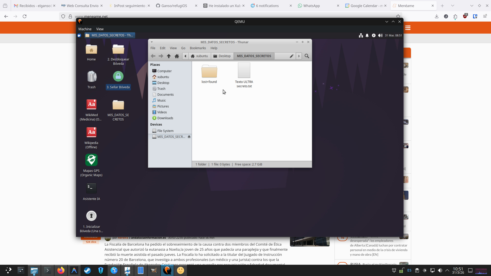
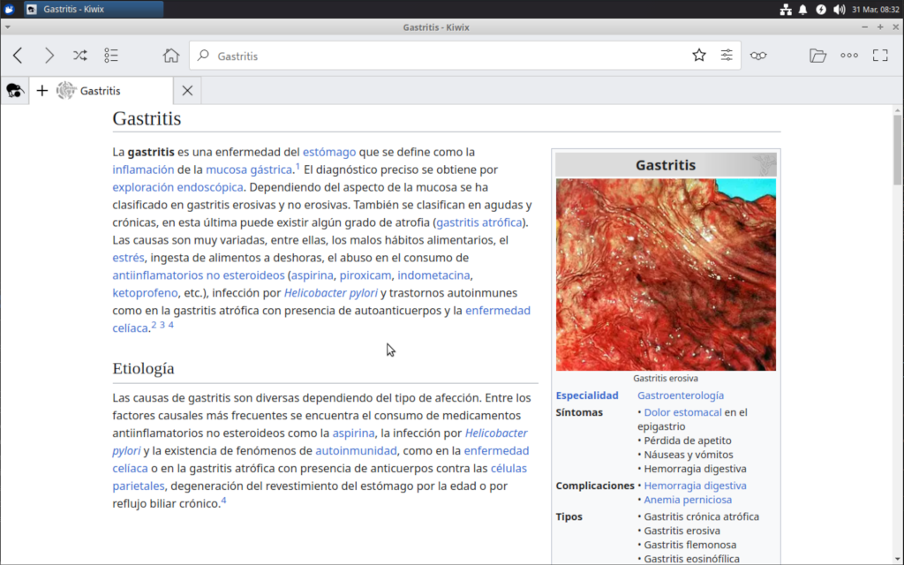
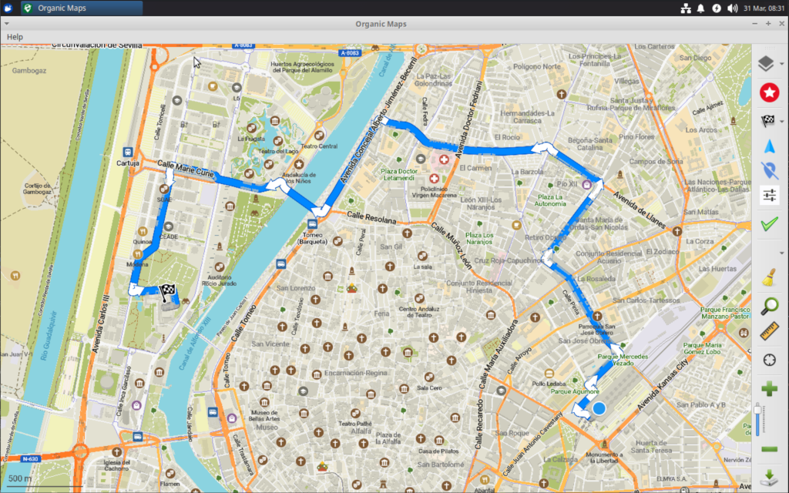

<h1 align="center">
  refugiOS - Tu Refugio Digital y Biblioteca de Supervivencia
</h1>

<p align="center">
  
  
  
  
</p>

> [!WARNING]
> **Estado del Proyecto:** refugiOS se encuentra actualmente en su **primera versión Alpha**. Es un proyecto en desarrollo activo y aún queda mucho camino por delante: internacionalización de la documentación, corrección de errores, mejoras en la interfaz de menús y la implementación de las funciones detalladas en el roadmap.

---

## 📖 ¿Qué es refugiOS?

**refugiOS** es un sistema operativo portátil diseñado para situaciones de emergencia, falta de conectividad a Internet o necesidad extrema de privacidad. 

A diferencia de otras soluciones complejas, **refugiOS convierte cualquier ordenador normal (incluso uno antiguo) en una estación de información completa** que arranca directamente desde un pendrive USB. 

Es una herramienta pensada para tener a mano todos los conocimientos, mapas y documentos vitales de forma segura, privada y totalmente funcional sin depender de la nube.

## ✨ Características Principales

*   **⚡ Arranca en cualquier PC (Plug-and-play):** No necesitas instalar nada en el ordenador que encuentres. Conectas el USB, enciendes el equipo y ya tienes tu refugio digital funcionando a máxima velocidad.
*   **📚 Conocimiento Universal Offline:** Incluye copias completas de la Wikipedia, WikiMed (medicina), enciclopedias de supervivencia y guías de oficios gracias a la tecnología de *Kiwix*.
*   **🤖 Inteligencia Artificial Privada:** Incorpora un asistente que funciona de forma 100% local, sin Internet. Puede ayudarte a resolver problemas técnicos, médicos o de traducción usando solo la potencia de tu ordenador.
*   **🗺️ Mapas y Navegación GPS:** Mapas detallados de todo el mundo mediante *Organic Maps*. Puedes buscar rutas y puntos de interés (fuentes, hospitales, refugios) sin emitir ninguna señal de red.
*   **🔒 Bóveda de Archivos Segura:** Sistema de cifrado profesional para guardar tus documentos más importantes (pasaportes, títulos, fotos) protegidos por una contraseña maestra.
*   **🌐 Adaptado a tu Idioma:** El sistema se configura automáticamente en tu idioma (español, inglés, francés, etc.), descargando solo los diccionarios y ayudas que necesitas.
*   Puedes ver en el apartado de [Aplicaciones y Software](doc/modulos_de_software.md) el estado actual del proyecto, con los módulos que están ya implementados y los que se añadirán en un futuro.

## 📸 Capturas de Pantalla

| Item | Captura de Pantalla |
| :--- | :--- |
| **Interfaz Principal** | <br>*Menú principal con una bóveda abierta* |
| **Conocimiento** | <br>*Enciclopedia médica (WikiMed)* |
| **Navegación** | <br>*Cartografía y navegación offline* |
| **Asistente** | <br>*Inteligencia Artificial local* |

## 🚀 Instalación Rápida

Si ya tienes un USB con una base de Linux (Xubuntu) recién instalada, solo tienes que conectar el equipo a Internet una vez y ejecutar este comando en la terminal:

```bash
sudo apt install curl -y
curl -fsSL https://raw.githubusercontent.com/Ganso/refugiOS/main/install.sh | bash
```

> [!IMPORTANT] 
> **¿Aún no tienes el USB de Linux preparado?** 
> Si estás empezando de cero, sigue primero nuestra **[Guía de Instalación Manual](doc/instalacion_manual.md)** para preparar tu pendrive desde Windows o Linux.

> [!NOTE] 
> El instalador te guiará paso a paso y te preguntará qué contenidos quieres incluir según el tamaño de tu USB. Es recomendable leerla en cualquier caso.

> [!TIP]
> **¿Ya tienes tu primer pendrive listo?** Una vez que lo hayas probado y configurado a tu gusto, te recomendamos **[clonarlo a otra unidad](doc/clonado_de_pendrive.md)** para tener una copia de seguridad o para dar copias a tus seres queridos.


## 🧪 Cómo probarlo (Prueba de concepto)

Si quieres validar el sistema de forma rápida sin pasar por el proceso completo de instalación, ofrecemos una imagen pre-configurada lista para usar.

1.  **Descarga la imagen:** [refugios_0.01_test.img](refugios_0.01_test.img)
2.  **Vuelca la imagen:** Sigue las instrucciones de **[Volcado final al pendrive físico](doc/guia_virtualizacion_y_pendrive.md#5-volcado-final-al-pendrive-físico)** en nuestro manual.
3.  **Requisitos:** Necesitarás un pendrive de **64Gb o más**.
4.  **Prueba en máquina virtual (Opcional):** Si prefieres no usar un pendrive todavía, puedes arrancar esta misma imagen en **QEMU o VirtualBox** siguiendo los pasos de **[Ejecución en VM](doc/guia_virtualizacion_y_pendrive.md#4-ejecución-y-configuración-en-vm)**.

**Características de la imagen de prueba:**
*   **Idioma:** Configurada íntegramente en **español**.
*   **Contenido incluido:** Wikipedia (versión sin imágenes), WikiHow, WikiMed (enciclopedia médica) y el asistente de IA nativo (modelo básico).
*   **Propósito:** Esta imagen se ofrece como una **prueba de concepto** para validar la compatibilidad con tu hardware y experimentar la interfaz de usuario de forma inmediata.


## 📚 Documentación Detallada

Para saber más sobre cómo funciona refugiOS y cómo sacarle el máximo partido, consulta las guías en el directorio `/doc/`:

*   **[Visión y Experiencia del Usuario](doc/vision_y_experiencia.md):** El propósito del proyecto y qué esperar al usarlo.
*   **[Comparativa de Soluciones](doc/soluciones_existentes.md):** Por qué refugiOS es diferente a otras alternativas.
*   **[Aplicaciones y Software](doc/modulos_de_software.md):** Información sobre Kiwix, Mapas e Inteligencia Artificial.
*   **[Arquitectura del Sistema](doc/arquitectura.md):** Detalles técnicos sobre la base Linux y su rendimiento.
*   **[Bóvedas de Seguridad](doc/bovedas_criptograficas.md):** Cómo funciona el cifrado de tus archivos personales.
*   **[Clonado de Unidades](doc/clonado_de_pendrive.md):** Cómo hacer copias exactas de tu USB en Windows o Linux.


---

## 🗃️ Agradecimientos y Fuentes

refugiOS es posible gracias al increíble trabajo de proyectos de código abierto como:
*   [Xubuntu](https://xubuntu.org/) y la comunidad de Ubuntu para la base del sistema operativo.
*   [Kiwix](https://www.kiwix.org/) y la [Fundación Wikimedia](https://wikimediafoundation.org/) por el acceso offline al conocimiento universal.
*   [Mozilla Ocho](https://github.com/Mozilla-Ocho/llamafile) por el motor de inferencia **Llamafile**.
*   [HuggingFace](https://huggingface.co/) y [bartowski](https://huggingface.co/bartowski) por las excelentes cuantizaciones de los modelos de IA.
*   Modelos de lenguaje **Phi-4-mini** (Microsoft) y **Qwen3** (Alibaba-Qwen).
*   [Organic Maps](https://organicmaps.app/) y los colaboradores de [OpenStreetMap](https://www.openstreetmap.org/) por la cartografía offline.
*   [Aria2](https://aria2.github.io/) para las descargas de alta eficiencia.
*   [Flatpak](https://flatpak.org/) y [Flathub](https://flathub.org/) por la distribución de aplicaciones modernas.
*   [Cryptsetup / LUKS](https://gitlab.com/cryptsetup/cryptsetup) para la seguridad y cifrado de datos personales.

---
*(refugiOS es una iniciativa de código abierto para la resiliencia digital. Actualmente en fase Alpha, buscamos colaboradores para internacionalizar la documentación, migrarla a formato wiki y pulir la experiencia de usuario según nuestro [Roadmap](doc/modulos_de_software.md#🔮-roadmap-módulos-planeados-a-futuro)).*
