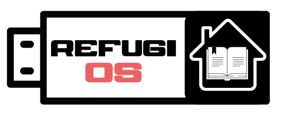

<h1 align="center">
  refugiOS - Tu Refugio Digital y Biblioteca de Supervivencia
</h1>

<p align="center">
  <a href="README.en.md"><strong>🇬🇧🇺🇸 Read this in English</strong></a>
</p>

<p align="center">
  <br />
  
  
  
  
  
</p>

> [!WARNING]
> **Estado del Proyecto:** refugiOS se encuentra actualmente en su **primera versión Beta**. Es un proyecto en desarrollo activo y aún queda camino por delante: corrección de errores y la implementación de funciones detalladas en el roadmap.

> [!IMPORTANT]
> **refugiOS no es una distribución Linux al uso.** No se instala en tu disco duro ni reemplaza tu sistema operativo. Es un sistema portátil que arranca desde un USB y funciona de forma completamente autónoma, sin instalar nada en el ordenador anfitrión. Solo necesitas un USB de 16 GB o más.

## ¿Qué es refugiOS?

**refugiOS** es un sistema operativo portátil pensado para funcionar sin conexión a Internet en situaciones de emergencia o de resiliencia personal. Se instala en un USB y arranca en cualquier PC o Raspberry Pi, llevando contigo Wikipedia completa, mapas offline de todo el mundo, una IA privada local, cifrado de archivos personales y guías de supervivencia, todo funcionando sin depender de ningún servidor ni nube.

La idea es sencilla: **prepáralo hoy en casa, úsalo cuando no haya Internet.**

→ Consulta la [Visión y Experiencia del Usuario](doc/Vision-y-Experiencia-ES.md) para una descripción completa del proyecto y qué esperar al usarlo.

---

## Inicio Rápido: Descarga la Imagen Pregenerada

La forma más fácil de tener refugiOS es descargar la imagen ya preparada, grabarla en un USB y arrancar:

### 1. Descarga la imagen

| Idioma | Descarga | Tamaño |
| :--- | :--- | :--- |
| 🇪🇸 **Español** | [refugios-base-16G-es.img.zip](https://refugios.ganso.org/refugios-base-16G-es.img.zip) | 3,7 GB comprimido (16 GB al descomprimir) |
| 🇬🇧🇺🇸 **Inglés** | [refugios-base-16G-en.img.zip](https://refugios.ganso.org/refugios-base-16G-en.img.zip) | 4,0 GB comprimido (16 GB al descomprimir) |

> **Última actualización de las imágenes: 28 de julio de 2026** (versión 0.23).

Descomprime el `.zip` antes de grabarlo: en Windows, clic derecho → *Extraer todo*; en Linux o macOS, `unzip refugios-base-16G-es.img.zip`. Obtendrás el fichero `.img` que se graba en el USB.

Necesitas un USB de **al menos 16 GB**. La partición del sistema se expandirá automáticamente al tamaño completo del USB en el primer arranque.

> [!NOTE]
> **¿Por qué no se ofrece una imagen completamente configurada de antemano?**
> Ofrecer una imagen lista con todos los contenidos posibles (Wikipedia completa con imágenes, múltiples modelos de IA local, cartografía de todo el mundo, etc.) exigiría un archivo de descarga descomunal de más de 150 GB. Por eso se distribuye una **imagen base ligera** que el usuario debe configurar en un entorno controlado (no de emergencia) con una buena conexión a Internet. De este modo, en el momento de una emergencia real, el dispositivo tendrá exactamente la información y recursos específicos que necesites.

### 2. Graba la imagen en tu USB

**Desde Windows** — Usa [Rufus](https://rufus.ie/) o [balenaEtcher](https://etcher.balena.io/):
1. Abre Rufus, selecciona tu USB y el archivo `.img` descargado.
2. Asegúrate de que el esquema de partición es **GPT** y el sistema destino es **UEFI**.
3. Pulsa **Empezar** y espera.

**Desde Linux** — Con el comando `dd`:
```bash
# ¡Verifica con lsblk que /dev/sdX es tu USB!
sudo dd if=refugios-base-16G-es.img of=/dev/sdX bs=4M status=progress conv=fsync
```

**Desde macOS** — Usa [balenaEtcher](https://etcher.balena.io/) o el comando `dd`:
```bash
sudo dd if=refugios-base-16G-es.img of=/dev/diskN bs=4M
```

### 3. Arranca desde el USB

1. Conecta el USB a cualquier PC y enciéndelo.
2. Pulsa **F12**, **F8** o **Esc** durante el arranque para seleccionar el USB como dispositivo de inicio.
3. El sistema arrancará automáticamente en el escritorio XFCE con el usuario `refugios` (sin contraseña).

### 4. Completa la instalación

> [!IMPORTANT]
> **Toda la instalación inicial (incluyendo ejecutar este asistente) debe realizarse en un entorno controlado y con conexión a Internet ANTES de que ocurra una emergencia.** Una vez finalizados todos los pasos y comprobado que el sistema funciona correctamente, tu dispositivo estará listo para operar de forma 100% offline.

En el escritorio encontrarás el icono **"Completar instalación de refugiOS"**. Haz doble clic sobre él, conéctate a Internet cuando te lo pida, y el asistente se encargará de descargar e instalar todo el contenido según la capacidad de tu USB.

También puedes ejecutarlo desde la terminal:
```bash
curl -fsSL https://raw.githubusercontent.com/Ganso/refugiOS/main/install.sh | bash
```

> [!TIP]
> La elección del dispositivo físico (pendrive, SSD, adaptador) condiciona el rendimiento y la durabilidad de tu refugiOS. Consulta la **[Guía de Elección del Medio](doc/Eleccion-Medio-Instalacion-ES.md)** antes de comprar.

---

## Métodos Alternativos

La imagen pregenerada es la forma más rápida y sencilla, pero si lo necesitas, también puedes montar refugiOS de otras maneras:

<details>
<summary><strong>💻 Montar refugiOS sobre un Live-USB de Xubuntu</strong></summary>

Si prefieres usar una ISO de Xubuntu como base, puedes crear un USB live con persistencia y después instalar refugiOS sobre él. Este método ofrece compatibilidad con hardware antiguo (BIOS/MBR) y un esquema dual (sistema inmutable + capa de persistencia).

1. Descarga [Xubuntu Minimal](https://xubuntu.org/) y créalo como USB persistente con [Rufus](https://rufus.ie/) o [mkusb](https://help.ubuntu.com/community/mkusb).
2. Arranca desde el USB y ejecuta el instalador:
   ```bash
   sudo apt install curl -y
   curl -fsSL https://raw.githubusercontent.com/Ganso/refugiOS/main/install.sh | bash
   ```

Consulta la **[Guía de Instalación en Xubuntu](doc/Instalacion-Xubuntu-ES.md)** para los pasos completos.

</details>

<details>
<summary><strong>🍓 Montar refugiOS en Raspberry Pi</strong></summary>

refugiOS funciona en Raspberry Pi 3B+ y superiores con Raspberry Pi OS:

1. Instala [Raspberry Pi OS (64-bit)](https://www.raspberrypi.com/documentation/computers/getting-started.html#raspberry-pi-imager) con Raspberry Pi Imager.
2. Arranca y ejecuta:
   ```bash
   sudo apt install curl -y
   curl -fsSL https://raw.githubusercontent.com/Ganso/refugiOS/main/install.sh | bash
   ```

El instalador detecta la arquitectura ARM y adapta todo automáticamente. Consulta la **[Guía de Instalación en Raspberry Pi](doc/Instalacion-Raspberry-ES.md)**.

</details>

<details>
<summary><strong>🛠️ Construir tu propia imagen de sistema</strong></summary>

Si necesitas control total sobre la imagen base o quieres preparar múltiples unidades idénticas, puedes generar una imagen desde cero con Debian Trixie + XFCE:

```bash
sudo bash scripts/build_refugios.sh 16G
```

Consulta la **[Guía de Construcción de Imagen de Sistema](doc/Construccion-Imagen-Sistema-ES.md)** para los detalles completos.

</details>

---

## Probar en una Máquina Virtual

Si quieres probar refugiOS antes de grabarlo en un USB, puedes arrancar cualquiera de las imágenes (pregenerada o construida por ti) en una máquina virtual con QEMU o VirtualBox. Esto funciona para x86 (PC y Xubuntu); la Raspberry Pi requiere hardware real.

```bash
# Con QEMU y aceleración KVM (Linux)
sudo qemu-system-x86_64 -enable-kvm -m 4G \
  -bios /usr/share/ovmf/OVMF.fd \
  -drive file=refugios-base-16G-es.img,format=raw
```

Consulta la **[Guía de Virtualización](doc/Guia-Virtualizacion-y-Pendrive-ES.md)** para instrucciones completas con QEMU, VirtualBox y métodos para probar imágenes de Xubuntu.

---

## Características Principales

*   **⚡ Arranca en cualquier PC:** Conectas el USB, enciendes y tu refugio digital funciona. No installs nada en el ordenador anfitrión.
*   **🍓 Soporte nativo para Raspberry Pi:** Instalación certificada en Raspberry Pi 3B+.
*   **📚 Conocimiento Universal Offline:** Copias completas de la Wikipedia, WikiMed, enciclopedias de supervivencia y guías de oficios.
*   **🤖 Inteligencia Artificial Privada:** Asistente que funciona 100% en local, sin Internet.
*   **🗺️ Mapas y Navegación GPS:** Mapas offline de todo el mundo con Organic Maps.
*   **🔒 Bóveda de Archivos Segura:** Cifrado profesional LUKS para proteger documentos sensibles.
*   **🌐 Adaptado a tu Idioma:** El sistema se configura automáticamente en español o inglés.

Consulta el **[Roadmap y Aplicaciones](doc/Modulos-y-Roadmap-ES.md)** para ver el estado actual del proyecto.

### Vídeo de Demostración

<p align="center">
  <a href="https://www.youtube.com/watch?v=ZsVwWdWbtng">
    
  </a>
  <br>
  <em>refugiOS corriendo en un Ryzen 5500, arrancado desde un pendrive USB 3.2 de gama de consumo</em>
</p>

---

## Documentación Detallada

### Fundamentos
*   **[Visión y Experiencia del Usuario](doc/Vision-y-Experiencia-ES.md):** Qué es refugiOS y qué esperar al usarlo.
*   **[Comparativa de Soluciones](doc/Soluciones-Existentes-ES.md):** Por qué refugiOS es diferente a otras alternativas.
*   **[Arquitectura del Sistema](doc/Arquitectura-ES.md):** Detalles técnicos sobre la base Linux y su rendimiento.

### Instalación y Configuración
*   **[Elección del Medio de Instalación](doc/Eleccion-Medio-Instalacion-ES.md):** Qué USB o SSD comprar según tu presupuesto.
*   **[Guía de Virtualización](doc/Guia-Virtualizacion-y-Pendrive-ES.md):** Cómo probar refugiOS en una máquina virtual (QEMU, VirtualBox).
*   **[Instalación en Xubuntu](doc/Instalacion-Xubuntu-ES.md):** Método alternativo sobre Live-USB de Xubuntu.
*   **[Instalación en Raspberry Pi](doc/Instalacion-Raspberry-ES.md):** Guía específica para Raspberry Pi.
*   **[Construcción de Imagen de Sistema](doc/Construccion-Imagen-Sistema-ES.md):** Cómo generar tu propia imagen desde cero.
*   **[Tabla de Compatibilidad](doc/Compatibilidad-ES.md):** Distribuciones y hardware certificado.

### Uso y Mantenimiento
*   **[Bóvedas de Seguridad](doc/Bovedas-Criptograficas-ES.md):** Cómo funciona el cifrado de archivos personales.
*   **[Clonado de Unidades](doc/Clonado-de-Pendrive-ES.md):** Cómo hacer copias exactas de tu USB.
*   **[Aplicaciones y Roadmap](doc/Modulos-y-Roadmap-ES.md):** Módulos disponibles y planificados.

---

## Historial de Versiones

### [0.23] - 2026-07-28

#### Añadido
- **Carpeta [`media/`](media/README.md) con todo el material gráfico:** el logotipo en sus distintos formatos y cuarenta capturas de pantalla de las aplicaciones principales, en español y en inglés, tomadas sobre el sistema real.
- **Documentación de la suite de tests en `doc/`**, en español e inglés, enlazada desde el índice de la wiki y desde las guías de construcción de imagen.

#### Cambiado
- **`logo/` pasa a ser `media/logo/`.** El instalador busca el fondo de escritorio en la ruta nueva y sigue aceptando la antigua en copias locales anteriores a esta versión.

→ Consulta el [CHANGELOG.md](CHANGELOG.md) para el detalle completo de esta versión.

### [0.22] - 2026-07-28

Revisión crítica de los scripts del proyecto centrada en errores que rompían el comportamiento de forma silenciosa. Todas las correcciones respetan el modelo de seguridad existente y la capacidad de funcionamiento sin conexión.

#### Corregido
- **La construcción de la imagen daba por bueno un chroot fallido:** El heredoc de `chroot` en `scripts/build_refugios.sh` no llevaba `set -e`, así que un fallo de `apt-get`, `grub-install` o `locale-gen` no lo detenía y el build informaba de éxito generando una imagen que no arranca. Ahora aborta al primer fallo con un mensaje descriptivo. También se descartan los restos de construcciones anteriores y se hace `sync` antes de desasociar el dispositivo loop.
- **La contraseña de las bóvedas no se confirmaba:** `cryptsetup luksFormat` se invocaba con `--batch-mode`, que es precisamente la opción que desactiva la verificación. El usuario tecleaba la contraseña una sola vez y, ante una errata, la bóveda quedaba inaccesible para siempre sin ningún aviso.
- **Las descargas grandes no podían completarse en conexiones lentas:** Se borraba el fichero parcial ante cualquier fallo, lo que anulaba la reanudación: un modelo de varios GB reiniciaba desde cero en cada intento. Los parciales se conservan ahora y el `timeout` absoluto deja de ser un límite a la duración legítima de la descarga.
- **El "Developer Mode" no tenía ningún efecto:** Ni en `install.sh` (los `wget` sobrescribían las copias locales) ni en `install.py` (`fetch_script` descargaba siempre desde GitHub). Ejecutar el instalador desde una copia del repositorio probaba en realidad el código publicado.
- **El motor de IA quedaba consumiendo memoria** al cerrar el lanzador, y el navegador se abría contra un puerto muerto porque se esperaba un `sleep` fijo insuficiente para cargar un modelo grande.
- **El idioma elegido por el usuario se ignoraba:** `scripts/i18n.sh` leía `~/.refugios_lang` y a continuación `$LANG` lo sobrescribía siempre.
- **Otros:** `fetch_url()` sin timeout podía colgar el instalador indefinidamente; las versiones se comparaban como texto (2.9 por encima de 2.10); `sanitize_for_dialog()` no se aplicaba en los menús; el instalador terminaba con código 0 aunque fallaran módulos; y `scripts/test_boot.sh` nunca encontraba la imagen al pasarle un tamaño y pedía 8 GB de RAM fijos.

#### Añadido
- **Suite de tests automáticos (`tests/`):** Comprobación estática, tests unitarios de `install.py`, tests de los scripts Bash con dobles de los binarios externos, test del bootstrapper, test de bóvedas LUKS con ciclo completo y test de construcción de imagen con fallo inyectado. No requiere `sudo`: lo que necesita root se ejecuta en un contenedor Debian privilegiado. Se ejecuta con `bash tests/run_all.sh` y está documentada en la **[Suite de Tests Automáticos](doc/Suite-de-Tests-ES.md)**.
- **Verificación de arranque por captura de pantalla:** `tests/qemu_boot_check.py` arranca una imagen sin interfaz gráfica y toma capturas en los instantes indicados, para comprobar el arranque completo sin intervención manual.

→ Consulta el [CHANGELOG.md](CHANGELOG.md) para el detalle completo de esta versión.

<details>
<summary><b>Versiones anteriores</b></summary>

### [0.21] - 2026-06-30

#### Corregido
- **`FileNotFoundError` del gestor de bóvedas:** El instalador no encontraba `refugios-vault.py` ni en local ni en remoto y fallaba durante el despliegue. Se ha añadido validación previa que comprueba la existencia del archivo en disco antes de referenciarlo o ejecutarlo; si no está disponible, registra un log descriptivo, muestra un aviso al usuario mediante `d.msgbox` y omite el icono del Vault, pero permite que el resto de la instalación continúe sin lanzar un traceback.
- **`UnicodeEncodeError` (latin-1) en el resumen de instalación:** Al mostrar el resumen de errores mediante `d.msgbox`, el script fallaba al encontrar caracteres no compatibles con latin-1 (específicamente `•` U+2022), ya que la librería `dialog` codifica las cadenas en latin-1. Se ha sustituido el bullet por `-` y se han saneado los mensajes.
- **Script de Kiwix ausente sin aviso:** La llamada a `fetch_script("refugios-kiwix.sh")` ignoraba el valor de retorno, por lo que si el script faltaba no se notificaba al usuario y los accesos directos de las bases de conocimiento quedaban rotos silenciosamente. Ahora se comprueba su existencia y se avisa de forma descriptiva.
- **Script de IA ausente solo registrado en log:** Cuando faltaba `refugios-ai-selector.sh`, el aviso se registraba únicamente en el log sin notificación al usuario. Ahora se muestra también un diálogo descriptivo.

#### Añadido
- **Función `sanitize_for_dialog()`:** Nueva utilidad en `install.py` que reemplaza caracteres Unicode tipográficos (`•`, `–`, `—`, comillas tipográficas, `…`) por equivalentes ASCII y codifica el resto a latin-1 con modo `replace`, garantizando compatibilidad con la librería `dialog`.
- **Validación previa de scripts críticos:** El instalador verifica ahora la existencia en disco de `refugios-vault.py`, `refugios-kiwix.sh` y `refugios-ai-selector.sh` tras intentar obtenerlos. Si alguno falta, se avisa al usuario (log + `d.msgbox`), se omite su icono de escritorio y la instalación continúa sin detenerse.
- **Nuevas claves de i18n:** `vault_script_missing`, `kiwix_script_missing` y `ai_script_missing` (EN + ES) con mensajes descriptivos que indican la causa y sugieren volver a ejecutar el instalador más adelante.
- **Limpieza de pantalla tras diálogos:** Se ejecuta `clear` en cada transición de diálogo a ejecución de comandos/instalación, en `install.py`, `scripts/refugios-vault.py` y `scripts/refugios-ai-selector.sh`, para que la salida de terminal quede más limpia entre fases.

#### Cambiado
- **Resumen de errores con guiones en vez de bullets:** La lista de componentes fallidos en el mensaje final usa ahora `-` en lugar de `•` para evitar el `UnicodeEncodeError` con `dialog`.

</details>

→ Consulta el [CHANGELOG.md](CHANGELOG.md) para el historial completo de versiones.

---

## Material Gráfico

La carpeta **[media/](media/README.md)** reúne todo el material gráfico del proyecto:

*   **[Logotipo](media/logo/)** en PNG, PDF vectorial y fuente de Illustrator, más el fondo de escritorio que aplica el instalador. Diseño de [Felipe Monge "PlayOnRetro"](https://x.com/PlayOnRetro); cítalo siempre que lo uses.
*   **[Capturas de pantalla](media/screenshots/README.md)** — cuarenta capturas de las aplicaciones principales funcionando, en español y en inglés, tomadas sobre el sistema real.

---

## Agradecimientos y Fuentes

Gracias a [Felipe Monge "PlayOnRetro"](https://x.com/PlayOnRetro) por el diseño del logo.

refugiOS es posible gracias al increíble trabajo de proyectos de código abierto como:
*   [Debian](https://www.debian.org/) y [Xubuntu](https://xubuntu.org/) por la base del sistema operativo.
*   [Raspberry Pi Foundation](https://www.raspberrypi.com/) por el hardware y el ecosistema de software ARM.
*   [Kiwix](https://www.kiwix.org/) y la [Fundación Wikimedia](https://wikimediafoundation.org/) por el acceso offline al conocimiento universal.
*   [Mozilla Ocho](https://github.com/Mozilla-Ocho/llamafile) por el motor de inferencia Llamafile.
*   [HuggingFace](https://huggingface.co/) y [unsloth](https://huggingface.co/unsloth) por las cuantizaciones optimizadas de los modelos de IA.
*   Modelos de lenguaje **Qwen3** (Alibaba-Qwen: 0.6B, 8B, 14B) y **Gemma-4** (Google: E4B, 26B-A4B).
*   [Organic Maps](https://organicmaps.app/) y los colaboradores de [OpenStreetMap](https://www.openstreetmap.org/) por la cartografía offline.
*   [Aria2](https://aria2.github.io/) para las descargas de alta eficiencia.
*   [Flatpak](https://flatpak.org/) y [Flathub](https://flathub.org/) por la distribución de aplicaciones modernas.
*   [Cryptsetup / LUKS](https://gitlab.com/cryptsetup/cryptsetup) para la seguridad y cifrado de datos personales.

---
*(refugiOS es una iniciativa de código abierto para la resiliencia digital. Actualmente en fase Beta, buscamos colaboradores para internacionalizar la documentación y pulir la experiencia de usuario según nuestro [Roadmap](doc/Modulos-y-Roadmap-ES.md)).*